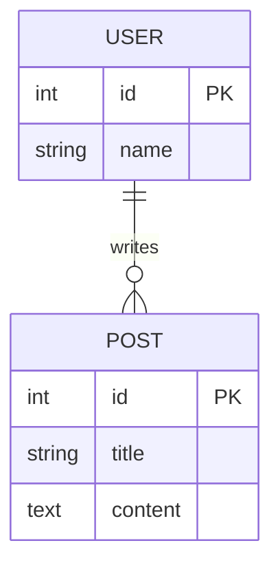
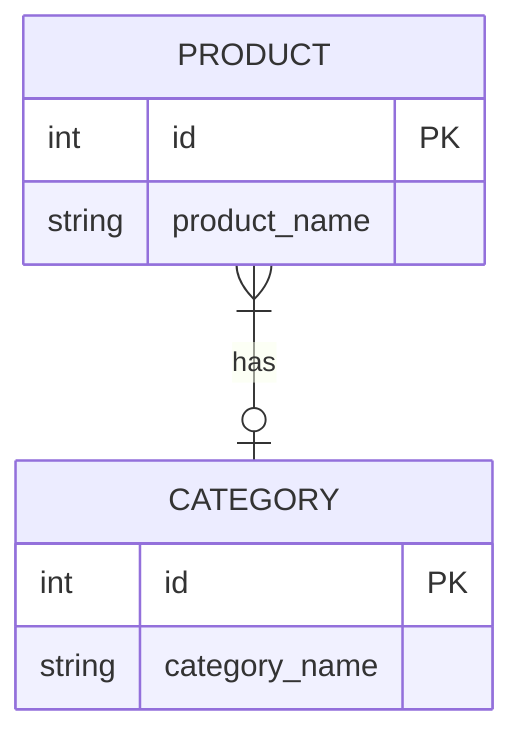

# Entity Relationship Diagram

```mermaid
erDiagram
USER {
    int id PK
    string name
}
POST {
    int id PK
    string title
    text content
}
USER ||--o{ POST : writes
```

```mermaid
erDiagram
PRODUCT {
    int id PK
    string product_name
}
CATEGORY {
    int id PK
    string category_name
}
PRODUCT }|--o| CATEGORY : has
```